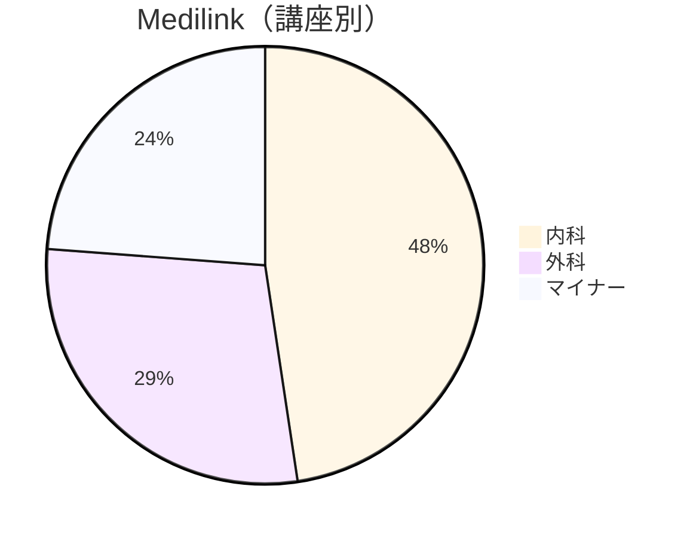
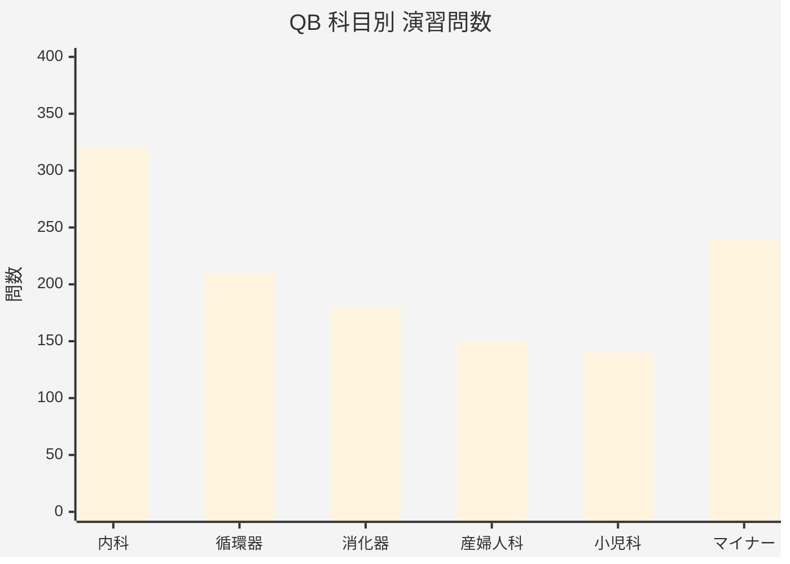
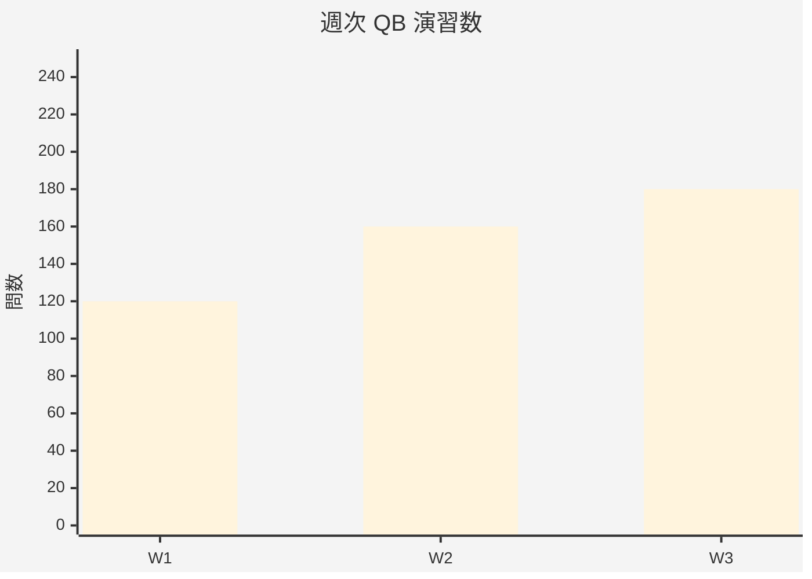

# 🩺 医師国家試験 学習ダッシュボード

Q-Assist / Medilink / QB を  
GitHub Issues × Projects × Actions で管理

---

## 📊 サマリー

| 指標 | 値 |
|---|---|
| **総学習時間** | **128時間30分** |
| 今週の学習時間 | 6時間30分 |
| **QB 累計** | **1,240問** |
| 今週のQB | 180問 |

---

## 📊 学習バランス（時間ベース）

```mermaid
%%{init: {"theme": "base"}}%%
xychart-beta
    title "教材別 学習時間（h）"
    x-axis ["Q-Assist", "Medilink"]
    y-axis "時間（h）" 0 --> 80
    bar [42, 63]
````

---

## 🎥 Q-Assist（時間）

**累計：42時間**

```mermaid
%%{init: {"theme": "base"}}%%
pie
    title Q-Assist（科目別）
    "内科総論" : 18
    "循環器" : 12
    "産婦人科" : 7
    "その他" : 5
```

---

## 📘 Medilink（時間）

**累計：63時間**



---

## 📝 QB（問題演習：問数ベース）

**累計：1,240問**

### 科目別 問数



### 週次 QB 演習数



---

## 🕒 直近のログ

```text
2026-01-15
  ├ Q-Assist｜内科総論｜心不全｜治療（45分）
  ├ Medilink｜循環器｜不整脈（60分）
  └ QB｜循環器（30問）

2026-01-14
  └ QB｜内科（50問）
```

---

## 🔁 運用ルール（重要）

* **動画教材（Q-Assist / Medilink）**

  * 指標：時間（分 → h）
* **QB**

  * 指標：問数のみ
  * 正答率・時間は Issue 側に残す
* README では
  👉 *量だけ* を可視化する
